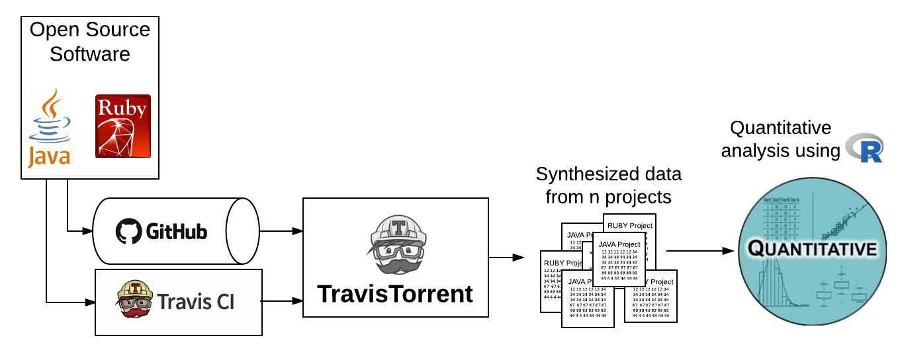

<style type="text/css"> 
.table {    width: 40%; margin: 0px auto; }
.caption {    text-align: center; padding-bottom: 40px;}
.figure {width: 70%; margin: 0px auto;}
img {text-align: center; display: block;margin-left: auto;margin-right: auto; margin: 0px auto; }
</style>
```{r setup, include=FALSE}
knitr::opts_chunk$set(echo = FALSE)
library(dplyr, warn.conflicts = FALSE)
library(pander, warn.conflicts = FALSE)
library(bibtex)
library(knitr)
require("knitcitations")
library(png)
library(grid)

####################################### load data
  # Carrega os dados
  #description <- read.csv('data/descriptionHeaders.csv', sep=";")
  builds <- readRDS('data/travis-sample.rds')
 
  #selecting relevant atributtes
  #TABELA COM UMA BUILD POR LINHA
builds_short<- builds%>% select(gh_project_name,tr_job_id,tr_started_at,tr_build_id, tr_num_jobs, tr_duration, gh_lang,gh_sloc, gh_test_lines_per_kloc, tr_status,tr_tests_run, tr_ci_latency, tr_setup_time)%>%
  group_by(tr_started_at,tr_build_id,gh_project_name)%>%
  summarise(distinct_job_id=n_distinct(tr_job_id) , tr_num_jobs=n_distinct(tr_job_id) ,tr_tests_run_sum=sum(tr_tests_run),tr_tests_run_mean=sum(tr_tests_run)/n(), tr_duration= unique(tr_duration), tr_ci_latency_sum= sum(tr_ci_latency),tr_setup_time_sum=sum(tr_setup_time), gh_lang=unique(gh_lang), gh_sloc=unique (gh_sloc),gh_test_lines_per_kloc = unique(gh_test_lines_per_kloc),tr_status=unique(tr_status), build_jobs_ids = paste(tr_job_id, collapse=", ")) %>%
  mutate(test_run_duration_mean = tr_tests_run_sum/(tr_duration), x_tr_sloc=(gh_sloc/1000) * gh_test_lines_per_kloc)

##filtrando duration e tr_test_run < 1 e NAs
builds_short<-builds_short[(builds_short$tr_duration >= 0),]
builds_short<-builds_short[(builds_short$tr_tests_run_sum > 0),]
builds_short<-builds_short[(!is.na(builds_short$tr_duration) ),]
builds_short<-builds_short[(!is.na(builds_short$tr_tests_run_sum) ),]

##numero de projeto total  no final disso tudo
projetos <- builds_short %>% select(gh_project_name,gh_lang)%>%
  group_by(gh_project_name)%>%
  summarise(n_builds = n() , gh_lang=unique(gh_lang)  )
projetos1 <- builds_short %>% group_by(gh_lang) %>% summarise(num_projects = n_distinct(gh_project_name) ,num_builds = n())

  #divide by gh_lang
  builds_short_java <- builds_short %>% filter(gh_lang=="java")
  builds_short_ruby <- builds_short %>% filter(gh_lang=="ruby")
  max.len <- max(length(builds_short_java$tr_duration), length(builds_short_ruby$tr_duration))

####################################### useful tables
  #table with java and ruby gh_sloc
  gh_sloc_ruby<-c(builds_short_ruby$gh_sloc, rep(NA, max.len - length(builds_short_ruby$gh_sloc))) 
  gh_sloc_java<-c(builds_short_java$gh_sloc, rep(NA, max.len - length(builds_short_java$gh_sloc))) 
  tr_sloc_ruby<-c(builds_short_ruby$x_tr_sloc, rep(NA, max.len - length(builds_short_ruby$x_tr_sloc))) 
  tr_sloc_java<-c(builds_short_java$x_tr_sloc, rep(NA, max.len - length(builds_short_java$x_tr_sloc))) 
  slocs_javaruby <- data.frame(gh_sloc_ruby, gh_sloc_java, tr_sloc_ruby,  tr_sloc_java ) 
  
  #table with java and ruby overall duration
  timing<- builds_short %>% select(tr_build_id, gh_lang, gh_sloc, tr_num_jobs, tr_duration) %>% arrange(tr_num_jobs)
  timing_dur_java<- c(builds_short_java$tr_duration, rep(NA, max.len - length(builds_short_java$tr_duration))) 
  timing_dur_ruby<- c(builds_short_ruby$tr_duration, rep(NA, max.len - length(builds_short_ruby$tr_duration))) 
  timing_dur_javaruby <- data.frame(tr_duration_java = timing_dur_java, tr_duration_ruby = timing_dur_ruby)
  
  #table with java and ruby number of jobs
  jobs <- builds_short %>%   group_by(tr_num_jobs) %>%   summarise(n_builds = n()) %>% arrange(as.numeric(tr_num_jobs))
  jobs_java<- c(builds_short_java$tr_num_jobs, rep(NA, max.len - length(builds_short_java$tr_num_jobs))) 
  jobs_ruby<-  c(builds_short_ruby$tr_num_jobs, rep(NA, max.len - length(builds_short_ruby$tr_num_jobs))) 
  jobs_javaruby <- data.frame(jobs_java=as.numeric(jobs_java), jobs_ruby=as.numeric(jobs_ruby))
  
  #table with java tr_num_jobs vs tr_duration
  jobduration_java <- builds_short_java %>% select(tr_num_jobs, tr_duration, gh_sloc)
  #table with ruby tr_num_jobs vs tr_duration
  jobduration_ruby <- builds_short_ruby %>% select(tr_num_jobs, tr_duration, gh_sloc)
 
  #table with java tr_num_jobs vs tr_duration (test code)
  jobduration_java_test <- builds_short_java %>% select(tr_num_jobs, tr_duration, x_tr_sloc)
  #table with ruby tr_num_jobs vs tr_duration (test code)
  jobduration_ruby_test <- builds_short_ruby %>% select(tr_num_jobs, tr_duration, x_tr_sloc)
 
  #table with test duration mean by number of jobs RUNTEST
  testdurationmean <- builds_short %>% group_by(tr_num_jobs = tr_num_jobs) %>% summarise(meanDuration = sum(tr_duration) / sum(tr_tests_run_sum), meanDuration2=sum(tr_duration)/n(), na.rm=T)
  testdurationmean_ruby <-  builds_short_ruby %>%  
    group_by(tr_num_jobs = as.numeric(tr_num_jobs)) %>%  
    summarise(meanDuration = sum(tr_duration)/sum(tr_tests_run_sum),meantestrun = sum(tr_tests_run_sum)/ n() , meanDuration2=sum(tr_duration)/n(), na.rm=T)
  testdurationmean_java <-  builds_short_java %>%  
    group_by(tr_num_jobs = as.numeric(tr_num_jobs)) %>%  
    summarise(meanDuration = sum(tr_duration)/sum(tr_tests_run_sum), meantestrun = sum(tr_tests_run_sum)/ n() , meanDuration2=sum(tr_duration)/n(),na.rm=T)
  testdurationmean_javaruby <- merge(testdurationmean_java,testdurationmean_ruby,by="tr_num_jobs" , all = TRUE)

#######
  
  
```
## Abstract

Continuous Integration (CI) is a development practice that requires code integration into a shared repository several times a day. Thus, each check-in is verified by an automated build, allowing teams to detect problems early. Travis CI is one of the CI tools available, and it's builds data are synthesized by a project called TravisTorrent. The goal in this paper is to use a sample of builds collected from TravisTorrent, to analyze which system language use more build jobs and to verify if the quantity of build jobs affect the test duration in Travis CI platform. We performed some hypotesis tests to achieve correlation between variables in order to answer to both research questions. 

## Keywords
Continuous integration, Test automation, Collaborative software development Travis CI, GitHub, TravisTorrent 

## Introduction

Continuous Integration (CI) development is used to automate test protocols in builds before deploying and to periodically test the system in order to verify the system quality. 
[@smartbear] Automated testing is the base of CI and developers should do it well and use it when it comes to:

- Repetitive tests that run for multiple builds.
- Tests that tend to cause human error.
- Tests that require multiple data sets.
- Frequently used functionality that introduces high risk conditions.
- Tests that are impossible to perform manually.
- Tests that run on several different hardware or software platforms and configurations.
- Tests that take a lot of effort and time when manual testing.

Testing a build with a CI service can take a little while depending on some factors like: latency induced by CI service, setup time, source lines of code (SLOC), number of build jobs, sequence of build jobs execution, number of tests, number of tests skipped [@travisci].

However, willing to find a way to speed up the automated testing, the research questions are:

**RQ1** The number of jobs in a build in a system varies according to the programming language?

&nbsp;&nbsp;&nbsp;&nbsp;&nbsp;&nbsp;**RQ1.H0** The number of jobs don't vary according to the programming language. 

&nbsp;&nbsp;&nbsp;&nbsp;&nbsp;&nbsp;**RQ1.H1** The number of jobs a system uses depends on the programming language. 

**RQ2** The more jobs a build have, the faster it’s going to be executed?

&nbsp;&nbsp;&nbsp;&nbsp;&nbsp;&nbsp;**RQ2.H0** The duration of execution doesn't have relation with the number of jobs.

&nbsp;&nbsp;&nbsp;&nbsp;&nbsp;&nbsp;**RQ2.H1** Considering that splitting a build in multiple jobs allows parallel execution, it’s expected a build to take less time to be executed when it has more jobs.

The goal in this paper is to use a sample of builds collected from TravisTorrent, synthesized from Travis CI and GitHub, of systems in Java and Ruby to analyze which system language use more build jobs and to verify if the quantity of build jobs affect the test duration in Travis CI platform.

Split up a build in many jobs and parallelize the jobs is good way to speed up automated tests. For Ruby, developers can use an parallel_tests and for Java there is a built in feature to run tests in parallel using JUnit. Travis CI showed some results where there was a drop from about 26 minutes to 19 minutes across 4 jobs [@travisci]. 


## Methodology

This section presents the methodology followed for extracting relevant facts about build jobs and test duration from the sample of builds synthesized from TravisCI and GitHub, using TravisTorrent, of systems in Java and Ruby. Figure 1 shows the steps followed on the methodology.




The data set used have information of one hundred projects written in Java and Ruby and it's freely available in [MSR Challenge 2017](https://2017.msrconf.org/#/challenge). After filtering the builds with no information about overall duration and with test run number of less than 1, the final data set had 69 projects and 10736 builds. The Table 1 shows the number of projects and builds in each language.


```{r}
kable(projetos1,col.names = c("Language", "Projects", "Builds"),  align = c('c', 'l', 'l'))
```

<p class="caption">**Table 1**. Number of projects and builds per language</p>
In order to answer the research questions was performed a purely quantitative study to address our propositions using [R](https://www.r-project.org/),  programming language and software environment for statistical computing and graphics. 

To answer RQ1 and RQ2, the projects were divided by language. For RQ1 was done a quantitative analysis with the attribute number of jobs. To answer RQ2, the attribute number of jobs and overall time duration were related and we did a quantitative analysis using this two attributes. 

The Mann-Whitney Test was choosen to verify the hypotesis of RQ1, since the data samples are independent and have a similar shape. The normal test was applied to the sample and it found a long tail distribution instead. Hence, the Mann-Whitney Test was more apropriate as the data don't follow the normal distribution.

For RQ2, the Spearman correlation test was used as the data set was large and non-parametric. Hence, the Spearman test was applied to measure the degree of association between the two variables. 

Willing to know more details about attributes that can interfere in the overall test duration, we explored some other attributes that were cited in section [Introduction] in order to verify its influence in the overall test duration. This analysis was done to explore the data and was performed before the quantitative analysis shown on Figure 1. Details on this is shown in next section [Preprocessing]. 


##Preprocessing

In general, the overall duration of  tests for both languages are almost in the same range, most of Java systems varies from 4  to 29 minutes and Ruby varies from 3 to 27 minutes, as shown in the Figure 2.  

```{r fig.cap="**Figure 2**. Overall build duration per language"}
###################################################
  #BOXPLOT OVERALL BUILD TEST DURATION PER LANGUAGE
###################################################
  boxplot(timing_dur_javaruby ,ylim=range(builds_short_java$tr_duration, builds_short_ruby$tr_duration, na.rm = TRUE) ,log="y", yaxt="n", main = "Overall test duration", ylab="Overall duration (s)")
  ylim <- par("usr")[3:4] 
  log10AtY <- seq(ceiling(ylim[1]), floor(ylim[2])) 
  axis(side=2, at=10^log10AtY, lab=as.expression(lapply(log10AtY, function(y)bquote(10^.(y))))) 
  qtjava <- quantile(timing_dur_java, na.rm=TRUE)
  qtruby <- quantile(timing_dur_ruby, na.rm=TRUE)
  text(1.5,qtjava[2], labels=qtjava[2], cex= 0.7)
  text(1.5, qtjava[3], labels=qtjava[3], cex= 0.7)
  text(1.5, qtjava[4] , labels=qtjava[4], cex= 0.7)
  
  text(2.5,qtruby[2], labels=qtruby[2], cex= 0.7)
  text(2.5, qtruby[3], labels=qtruby[3], cex= 0.7)
  text(2.5,  qtruby[4], labels=qtruby[4], cex= 0.7)
  
  #summary(timing_dur_ruby)
  #summary(timing_dur_java)
  
```

Comparing the SLOC and the LOC of the test progam, Java has bigger projecs than' Ruby. Most of Java systems are in between 12367 and 84189 LOC, while Ruby systems's are in between 614 and 6686 LOC. The test program in Java are in between 3456 and 24758 and Ruby's are in between 472 and 6685. All these numbers can be verified in the Figure 3.    

```{r fig.cap="**Figure 3**. SLOC and test program LOC per language."}
########################################### 
#BOXPLOT  SLOC AND TEST LOC
#########################################
  boxplot(slocs_javaruby ,ylim=range(builds_short_java$gh_sloc, builds_short_ruby$gh_sloc),log="y", yaxt="n", main = "SLOCs")
  ylim <- par("usr")[3:4] 
  log10AtY <- seq(ceiling(ylim[1]), floor(ylim[2])) 
  axis(side=2, at=10^log10AtY, lab=as.expression(lapply(log10AtY, function(y)bquote(10^.(y))))) 
  
  qtjava <- quantile(slocs_javaruby$gh_sloc_java, na.rm=TRUE)
  qtruby <- quantile(slocs_javaruby$gh_sloc_ruby, na.rm=TRUE)
  text(1.45,qtjava[2], labels=ceiling(qtjava[2]), cex= 0.7)
  text(1.45, qtjava[3], labels=ceiling(qtjava[3]), cex= 0.7)
  text(1.45, qtjava[4] , labels=ceiling(qtjava[4]), cex= 0.7)
  
  text(1.55,qtruby[2], labels=ceiling(qtruby[2]),  cex= 0.7)
  text(1.55, qtruby[3], labels=ceiling(qtruby[3]), cex= 0.7)
  text(1.55,  qtruby[4], labels=ceiling(qtruby[4]), cex= 0.7)

  qtjava <- quantile(slocs_javaruby$tr_sloc_java, na.rm=TRUE)
  qtruby <- quantile(slocs_javaruby$tr_sloc_ruby, na.rm=TRUE)
  
  text(4.55,qtjava[2], labels=ceiling(qtjava[2]), cex= 0.7)
  text(4.55, qtjava[3], labels=ceiling(qtjava[3]), cex= 0.7)
  text(4.55, qtjava[4] , labels=ceiling(qtjava[4]), cex= 0.7)
  
  text(2.45,qtruby[2], labels=ceiling(qtruby[2]),  cex= 0.7)
  text(2.45, qtruby[3], labels=ceiling(qtruby[3]), cex= 0.7)
  text(2.45,  qtruby[4], labels=ceiling(qtruby[4]), cex= 0.7)
  
```


## Results

This section shows the results obtained from the quantitative analysis over the sample. 

#### Number of builds according to the language (RQ1)

In order to answer RQ1, was plotted a boxplot graph to visualize the number of jobs used in both languages, shown in Figure 4. The results show that Java's systems tend to have no more than three jobs, while Ruby's tend to have a maximum of 6 jobs but with lots of outliers values, some Ruby's systems have more than 10 jobs and the highest value is 162 jobs.

```{r fig.cap="**Figure 4**. Number of jobs per language"}
################################################
  #BOXPLOT NUMBER OF JOBS PER LANGUAGE
################################################
  boxplot(jobs_javaruby,  main = "Number of jobs",log="y", yaxt="n" )
  ylim <- par("usr")[3:4] 
  log10AtY <- seq(ceiling(ylim[1]), floor(ylim[2])) 
  axis(side=2, at=10^log10AtY, lab=as.expression(lapply(log10AtY, function(y)bquote(10^.(y))))) 
 
  qtjava <- quantile(jobs_javaruby$jobs_java, na.rm=TRUE)
  qtruby <- quantile(jobs_javaruby$jobs_ruby, na.rm=TRUE)
  text(1.5,qtjava[2], labels=qtjava[2], cex= 0.7)
  text(1.5, qtjava[3], labels=qtjava[3], cex= 0.7)
  text(1.5, qtjava[4] , labels=qtjava[4], cex= 0.7)
  
  text(2.5,qtruby[2], labels=qtruby[2], cex= 0.7)
  text(2.5, qtruby[3], labels=qtruby[3], cex= 0.7)
  text(2.5,  qtruby[4], labels=qtruby[4], cex= 0.7)
```

The results of Mann-Whitney returned a p-value of 2.2e-16, rejecting the null hypothesis RQ1.H0. It means that at .05 significance level, the number of jobs of a system depends on the programming language. The complete Mann-Whitney test result is shown below: 

```{r}
  ###################################################
  #hypothesis tests
  ###################################################
  
  #assumptions tests (Gabi)
  #shapiro.test(jobs_javaruby$jobs_java[1:5000])
  #shapiro.test(jobs_javaruby$jobs_ruby[1:5000])
  
  #hist(jobs_javaruby$jobs_java)
  #hist(jobs_javaruby$jobs_ruby)
  #Test-T discarded
  
  #Mann-Whitney
  
  # independent 2-group Mann-Whitney U Test
  #wilcox.test(y,x) # where y and x are numeric
  wilcox.test(jobs_javaruby$jobs_java , jobs_javaruby$jobs_ruby)
  
```


#### Number of builds vs. overall test duration (RQ2)

With the aim of answering RQ2, was verified the relation between overall duration mean and the number of jobs. The results can be seen in Figure 5, where the radius of the circles are the mean test run. It shows a very weak correlation between the attributes overall duration mean and number of jobs.   

```{r  echo=FALSE, cache=FALSE, results=FALSE, warning=FALSE, comment=FALSE}

########################################################
# 3D - OVERALL DURATION MEAN  VS NUM JOBS VS NUMERO MEDIO DE TESTES       IN JAVA AND RUBY 
#########################################################
  par(mfrow=c(1,2))
      with(testdurationmean_java, symbols(x=tr_num_jobs, y=meanDuration2, circles=meantestrun, inches=1/5,ann=F, bg="steelblue2", fg=NULL, ylim=range(testdurationmean$meanDuration2, na.rm = TRUE)))
    title(main="Number of jobs vs.\n overall duration mean", xlab="Number of jobs", ylab="Overall duration mean (s)")

 
  legend(8, 5000, legend="Java", cex=1 )  
  text(testdurationmean_java$tr_num_jobs[5],testdurationmean_java$meanDuration2[5]+250, labels=ceiling(testdurationmean_java$meantestrun[5]) , cex= 0.7)
  text(testdurationmean_java$tr_num_jobs[4],testdurationmean_java$meanDuration2[4]+250, labels=ceiling(testdurationmean_java$meantestrun[4]) , cex= 0.7)
  text(testdurationmean_java$tr_num_jobs[1],testdurationmean_java$meanDuration2[1]+250, labels=ceiling(testdurationmean_java$meantestrun[1]) , cex= 0.7)
  text(testdurationmean_java$tr_num_jobs[3],testdurationmean_java$meanDuration2[3]+250, labels=ceiling(testdurationmean_java$meantestrun[3]) , cex= 0.7)
  text(testdurationmean_java$tr_num_jobs[8],testdurationmean_java$meanDuration2[8]+800, labels=ceiling(testdurationmean_java$meantestrun[8]) , cex= 0.7)
  text(testdurationmean_java$tr_num_jobs[6],testdurationmean_java$meanDuration3[6]+250, labels=ceiling(testdurationmean_java$meantestrun[6]) , cex= 0.7)
  

     with(testdurationmean_ruby, symbols(x=tr_num_jobs, y=meanDuration2,circles=meantestrun, inches=1/5,ann=F, bg="darkorchid3", fg=NULL, ylim=range(testdurationmean_ruby$meanDuration2, na.rm = TRUE)))
  title(main="Number of jobs vs.\n overall duration mean",xlab="Number of jobs", ylab="Overall duration mean (s)")
 
  
  legend(110, 5000, legend="Ruby", cex=1 ) 
  
  text(testdurationmean_ruby$tr_num_jobs[40],testdurationmean_ruby$meanDuration2[40]+350, labels=ceiling(testdurationmean_ruby$meantestrun[40]) , cex= 0.7)
  text(testdurationmean_ruby$tr_num_jobs[39],testdurationmean_ruby$meanDuration2[39]+250, labels=ceiling(testdurationmean_ruby$meantestrun[39]) , cex= 0.7)
  text(testdurationmean_ruby$tr_num_jobs[38],testdurationmean_ruby$meanDuration2[38]-700, labels=ceiling(testdurationmean_ruby$meantestrun[38]) , cex= 0.7)
  text(testdurationmean_ruby$tr_num_jobs[1],testdurationmean_ruby$meanDuration2[1]-600, labels=ceiling(testdurationmean_ruby$meantestrun[1]) , cex= 0.7)
  text(testdurationmean_ruby$tr_num_jobs[34],testdurationmean_ruby$meanDuration2[34]+250, labels=ceiling(testdurationmean_ruby$meantestrun[34]) , cex= 0.7)
  
    par(mfrow=c(1,1))
``` 
<p class="caption">**Figure 5**. Overall duration mean vs. number of jobs</p>

The Spearman's rank correlation coefficient was calculated for the number of jobs and the mean overall duration, was found a ρ=0.1666667, that means a very weak correlation between the variables. The results of Spearman's rank correlation are shown below:

```{r}
cor.test(testdurationmean_java$tr_num_jobs, testdurationmean_java$meanDuration2, method="spearman")
```


It was also verified the relation between mean test run duration and the number of jobs. The results can be seen in Figure 6, where the radius of the circles are the mean test run. It shows there must be correlation between the attributes mean test run duration and number of jobs. 
```{r echo=FALSE, cache=FALSE, results=FALSE, warning=FALSE, comment=FALSE}
########################################################
# 3D - TEST RUN DURATION MEAN  VS NUM JOBS VS NUMERO MEDIO DE TESTES       IN JAVA AND RUBY 
#########################################################
  par(mfrow=c(1,2))
      with(testdurationmean_java, symbols(x=tr_num_jobs, y=meanDuration, circles=meantestrun, inches=1/5,ann=F, bg="steelblue2", fg=NULL, ylim=range(builds_short_java$test_run_duration_mean, na.rm = TRUE),log="y", yaxt="n"))
    title(main="Number of jobs vs.\n test run duration mean", xlab="Number of jobs", ylab="Test run duration mean (s)")
    ylim <- par("usr")[3:4] 
    log10AtY <- seq(ceiling(ylim[1]), floor(ylim[2])) 
    axis(side=2, at=10^log10AtY, lab=as.expression(lapply(log10AtY, function(y)bquote(10^.(y))))) 
 
  legend(9, 50, legend="Java", cex=1 )  
  text(testdurationmean_java$tr_num_jobs[1],testdurationmean_java$meanDuration[1]+4, labels=ceiling(testdurationmean_java$meantestrun[1]) , cex= 0.7)
  text(testdurationmean_java$tr_num_jobs[4],testdurationmean_java$meanDuration[4]+0.5, labels=ceiling(testdurationmean_java$meantestrun[4]) , cex= 0.7)
  text(testdurationmean_java$tr_num_jobs[8],testdurationmean_java$meanDuration[8]+0.5, labels=ceiling(testdurationmean_java$meantestrun[8]) , cex= 0.7)
  text(testdurationmean_java$tr_num_jobs[7],testdurationmean_java$meanDuration[7]+0.5, labels=ceiling(testdurationmean_java$meantestrun[7]) , cex= 0.7)
  text(testdurationmean_java$tr_num_jobs[6],testdurationmean_java$meanDuration[6]+1.5, labels=ceiling(testdurationmean_java$meantestrun[6]) , cex= 0.7)
  text(testdurationmean_java$tr_num_jobs[5],testdurationmean_java$meanDuration[5]+1.5, labels=ceiling(testdurationmean_java$meantestrun[5]) , cex= 0.7)
  

     with(testdurationmean_ruby, symbols(x=tr_num_jobs, y=meanDuration,circles=meantestrun, inches=1/5,ann=F, bg="darkorchid3", fg=NULL, ylim=range(builds_short_java$test_run_duration_mean, na.rm = TRUE),log="y", yaxt="n"))
  title(main="Number of jobs vs.\n test run duration mean",xlab="Number of jobs", ylab="Test run duration mean (s)")
  ylim <- par("usr")[3:4] 
  log10AtY <- seq(ceiling(ylim[1]), floor(ylim[2])) 
  axis(side=2, at=10^log10AtY, lab=as.expression(lapply(log10AtY, function(y)bquote(10^.(y))))) 
  
  legend(110, 50, legend="Ruby", cex=1 ) 
  
  text(testdurationmean_ruby$tr_num_jobs[40],testdurationmean_ruby$meanDuration[40]+0.02, labels=ceiling(testdurationmean_ruby$meantestrun[40]) , cex= 0.7)
  text(testdurationmean_ruby$tr_num_jobs[39],testdurationmean_ruby$meanDuration[39]+0.02, labels=ceiling(testdurationmean_ruby$meantestrun[39]) , cex= 0.7)
  text(testdurationmean_ruby$tr_num_jobs[38],testdurationmean_ruby$meanDuration[38]+0.1, labels=ceiling(testdurationmean_ruby$meantestrun[38]) , cex= 0.7)
  text(testdurationmean_ruby$tr_num_jobs[1],testdurationmean_ruby$meanDuration[1]+0.9, labels=ceiling(testdurationmean_ruby$meantestrun[1]) , cex= 0.7)
  #text(testdurationmean_ruby$tr_num_jobs[6],testdurationmean_ruby$meanDuration[6]+1.5, labels=ceiling(testdurationmean_ruby$meantestrun[6]) , cex= 0.7)
  text(testdurationmean_ruby$tr_num_jobs[29],testdurationmean_ruby$meanDuration[29]-0.03, labels=ceiling(testdurationmean_ruby$meantestrun[29]) , cex= 0.7)
  
    par(mfrow=c(1,1))
    
```
<p class="caption">**Figure 6**. Overall duration mean vs. number of jobs</p>

The Spearman's rank correlation coefficient was also calculated for the number of jobs and the mean test run duration, was found a ρ=-0.6666667, that means a moderate correlation between the variables, it means that the mean test run duration tends to decrease when the number of jobs rise. The results of Spearman's rank correlation are shown below:

```{r}
cor.test(testdurationmean_java$tr_num_jobs, testdurationmean_java$meanDuration, method="spearman")
```


## Conclusion

Speed up a test suite in a CI service is a very important task, mainly in a collaborative development enviroment where we have multiple developers and multiple job to be deployed on demand.

Divide a build in n-jobs opens possibilities to execute unit tests and integration tests in parallel, making a good use of the time and the processor of the virtual machine [@travisci].

The results showed that Ruby's systems tend to use more jobs than Java's, but surprisingly it doesn't have a significant gain in the overall build duration. It's not possible to make any assumption about how the number of jobs relate to the overall build duration. 

According to the mean test run duration of a build, results showed that they have a moderate relation with the number of jobs. Then, the mean test run duration tends to reduce when the number of jobs grows. 

Despite the fact there's a very low correlation between the number of jobs and the overall duration of a build, it would worth it to investigate if developers are parallelizing build jobs and make experiments to find out the gain obtained splitting up a build and parallelizing the jobs in time execution. 

## References


